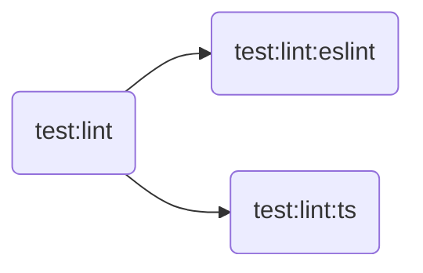
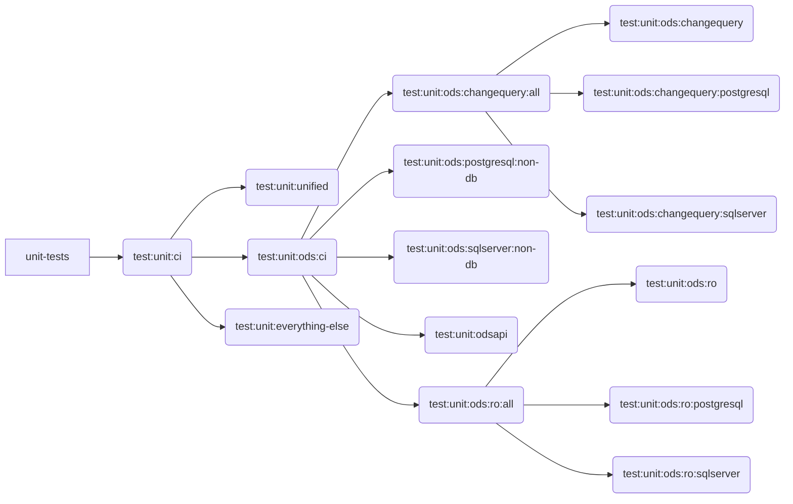
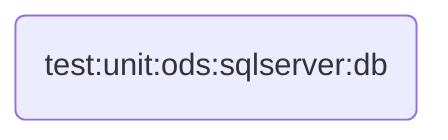
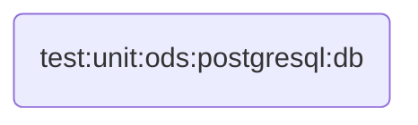

# MetaEd Automated Tests

"Command" in the table below refers to `npm run <command>`; it is the name of a script in `package.json`. The "CI" column
indicates if the task is run either explicitly or implicitly in GitHub Actions.

| Command                                | CI                       | Purpose                                                                                                           |
| -------------------------------------- | ------------------------ | ----------------------------------------------------------------------------------------------------------------- |
| `test`                                 | no                       | runs `test:lint` amd `test:unit`                                                                                  |
| `test:coverage`                        | no                       | runs all tests along with code coverage analysis                                                                  |
| `test:lint`                            | X                        | Runs `test:lint:ts` and `test:lint:eslint`                                                                        |
| `test:lint:eslint`                     | via `test:lint`          | Eslint on all JS and TS files                                                                                     |
| `test:lint:ts`                         | via `test:lint`          | Compile TypeScript project                                                                                        |
| `test:unit`                            | see below                | Runs `test:unit:unified`, `test:unit:ods`, and `test:unit:everything-else`                                        |
| `test:unit:ci`                         | X                        | Like above, but in CI (continuous integration) mode                                                               |
| `test:unit:unified`                    | via `test:unit:ci`       | Tests for package `metaed-plugin-edfi-unified`                                                                    |
| `test:unit:ods`                        | see below                | Runs `ods:changequery:all`, `ods:postgresql:non-db`, `ods:ro:all`, `ods:relational`, `sqlserver:non-db`, `odsapi` |
| `test:unit:ods:ci`                     | via `test:unit:ci`       | Above, but in CI mode                                                                                             |
| `test:unit:ods:changequery:all`        | via `...ods:ci`          | Runs `ods:changequery`, `ods:changequery:postgresql`, `ods:changequery:sqlserver`                                 |
| `test:unit:ods:changequery`            | via `...changequery:all` | Tests for package `metaed-plugin-edfi-ods-changequery`                                                            |
| `test:unit:ods:changequery:postgresql` | via `...changequery:all` | Tests for package `metaed-plugin-edfi-ods-changequery-postgresql`                                                 |
| `test:unit:ods:changequery:sqlserver`  | via `...changequery:all` | Tests for package `metaed-plugin-edfi-ods-changequery-sqlserver`                                                  |
| `test:unit:ods:postgresql:db`          | X                        | Integration tests for package `metaed-plugin-edfi-ods-postgresql`                                                 |
| `test:unit:ods:postgresql:non-db`      | via `...ods:ci`          | Unit tests for package  `metaed-plugin-edfi-ods-postgresql`                                                       |
| `test:unit:ods:postgresql:setup-db`    | no                       | Initializes database in preparation for running the DB integration tests                                          |
| `test:unit:ods:ro:all`                 | via `...ods:ci`          | Runs `ods:ro`, `ods:ro:postgresql`, and `ods:ro:sqlserver`                                                        |
| `test:unit:ods:ro`                     | via `...ro:all`          | Tests for package `metaed-plugin-edfi-ods-recordownership`                                                        |
| `test:unit:ods:ro:postgresql`          | via `...ro:all`          | Tests for package `metaed-plugin-edfi-ods-recordownership-postgresql`                                             |
| `test:unit:ods:ro:sqlserver`           | via `...ro:all`          | Tests for package `metaed-plugin-edfi-ods-recordownership-sqlserver`                                              |
| `test:unit:ods:relational`             | via `...ods:ci`          | Tests for package `metaed-plugin-edfi-ods-relational`                                                             |
| `test:unit:ods:sqlserver:all`          | via `test:unit:ci`       | Runs `ods:sqlserver`, `ods:sqlserver:db`, and `ods:sqlserver:non-db`                                              |
| `test:unit:ods:sqlserver`              | via `...sqlserver:all`   | Unit and integration tests for package `metaed-plugin-edfi-ods-sqlserver`                                         |
| `test:unit:ods:sqlserver:db`           | via `...sqlserver:all`   | Integration tests for package `metaed-plugin-edfi-ods-sqlserver`                                                  |
| `test:unit:ods:sqlserver:non-db`       | via `...ods:ci`          | Unit tests for package `metaed-plugin-edfi-ods-sqlserver`                                                         |
| `test:unit:odsapi`                     | via `...ods:ci`          | Tests for package `metaed-plugin-edfi-odsapi`                                                                     |
| `test:unit:everything-else`            | via `test:unit:ci`       | Tests for all packages _other than_ `metaed-plugin-edfi-ods-*` and `metaed-plugin-edfi-unified`                   |

## GitHub Actions: On-Pullrequest

In [on-pullrequest.yml](../.github/workflows/on-pullrequest.yml) we have the jobs described below:

### lint

### unit-tests

### sql-server-tests

### postgresql-tests

