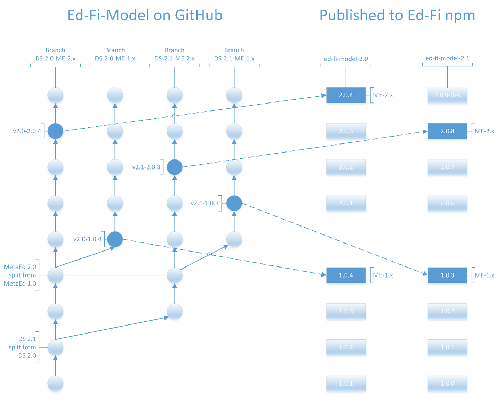

# Ed-Fi-Model Branching and Tagging Pattern

## Introduction

The Alliance [Ed-Fi-Model repository](https://github.com/Ed-Fi-Closed/Ed-Fi-Model) on GitHub is the designated location of
the .metaed files that define the Ed-Fi Data Standard for versions 2.0 and up.  Work on new versions of the Data Standard
takes place here, and it is the source for the core Data Standard files consumed by MetaEd.

## Versioning

Versions of the MetaEd technology must be able to change independently from the Data Standard as defined in .metaed files.
This is because Ed-Fi artifacts will be the product of both a version of the Data Standard .metaed files and a version of
MetaEd.  For example, hotfixes to Ed-Fi technologies may manifest themselves as hotfixes to MetaEd generators, requiring a
MetaEd patch version bump (for example from MetaEd 1.0.0 to 1.0.1).  Similarly, MetaEd provides the agility to fix a
documentation typo in a Data Standard .metaed file and release it with its own patch version bump (for example, from 2.1.0 to
2.1.1).

More generally, there are now two dimensions of change to consider in managing Data Standard artifacts.  We can envision the
relationship between MetaEd and Data Standard versions as a Support Matrix that expresses a version range of MetaEd artifact
generators and a version range of Data Standard .metaed files.  An example is shown in the next figure, where different
versions of MetaEd support different versions of the Data Standard.

## GitHub branch naming

Branch naming for active branches will follow a pattern that incorporates both the Data Standard version and MetaEd version.
Names should be prefixed by _DS-_ followed by the major.minor version of the Data Standard, followed by an _\-ME-_ separator
and the major.x version of MetaEd.  For example, the branch supporting Data Standard 2.1 on any 1.x version of MetaEd would
be named _DS-2.1-ME-1.x_.  These branches would represent the work for each supported Data Standard and MetaEd major version
pairing, and would replace what has previously been the _development_ branch.  An example of this branching plan is shown in
the next figure.

  

Data Standard versions are delivered to users of the MetaEd IDE via the Ed-Fi npm registry currently hosted on MyGet.  The
design of the Ed-Fi-Model npm registry must take the Data Standard and MetaEd version relationship into account.  In order
for a version of the MetaEd IDE to manage multiple Data Standard versions at a project (directory) level, Ed-Fi-Model
packages are published by Data Standard version.  For example, versions of Data Standard 2.0 are published as
_ed-fi-model-2.0_ and versions of Data Standard 2.1 are published as _ed-fi-model-2.1_.

Publication of the .metaed files from Ed-Fi-Model requires versioning corresponding to the version of MetaEd supported, which
must follow semantic versioning (semver) conventions.  Npm requires this as a part of package dependency management, which
the MetaEd IDE takes advantage of for installation and upgrades.  Versions in semver are built from three numbers separated
by periods.  The three numbers are referred to as major, minor and patch.  With semantic versioning, the rules for
incrementing versions are as follows:

* Increment the major version when there are incompatible changes,
* Increment the minor version when there is new functionality that is backwards-compatible, and
* Increment the patch version when there are backwards-compatible bug fixes.

In the example of .metaed files, the major.minor portion of the version would correspond directly to the version of the
MetaEd technology (implying that MetaEd technologies follow semver as well), while the patch versions represent fixes to
the standard. The npm packages would be tagged using distribution tags (dist-tags) that indicate the latest version suitable
for each supported major version of MetaEd.  
Unlike tagging in Git, dist-tags are intended to move over time to represent the latest version for a specific purpose. For
example, if the 1.0.4 version of ed-fi-model-2.0 was the latest supported version of Data Standard 2.0 for MetaEd 1.x, it
would receive the dist-tag ME-1.x. This would allow MetaEd 1.x versions to update to the latest Data Standard 2.0 version
they are compatible with. This tagging scheme does not go beyond the MetaEd major version as we assume dropping support for a
Data Standard version is a breaking change requiring a new MetaEd major version.

Semantic versioning provides the opportunity to version packages as pre-release, which allows for the publication of packages
to a separate channel.  MetaEd QA and beta testers can make use of a pre-release channel to test Data Standard .metaed file
changes without interfering with regular users.  Pre-release versioning is standardized as a dash separator followed by the
pre-release name, followed by a period and number incremented with each revision.  For example, _2.0.9-dev.4_ is a _dev_
pre-release of version _2.0.9_.

## GitHub tags naming

Each published version of Ed-Fi-Model should be tagged in GitHub.  Corresponding GitHub tags should include the npm version
with a prefix to accommodate multiple DS versions in the same GitHub repository.  These prefixes should start with _v_
followed by the major.minor version of the Data Standard, then a dash separator and a major.minor.patch version number.  This
major.minor version corresponds to the version of MetaEd that the .metaed files apply to, and would be followed by a patch
version that is incremented per published release.  For example, a publication supporting Data Standard 2.1 would be tagged
_v2.1-1.0.3_ in GitHub for the third patch release of Ed-Fi-Model .metaed files targeting MetaEd 1.0.

**Update from original proposal:** In practice, GitHub tags naming is slightly different from the original proposal in that
"DS" and "ME" are included like they are in branch naming. The driver for this is that the full semantic version of the data
standard release is needed (meaning the patch version is included), so it made sense to follow the branch naming more
closely. For example, assuming the above-mentioned tag is for the 2.1.0 release of Data Standard 2.1, the tag _v2.1-1.0.3_
would instead be named _DS__\-2.1.0-ME-1.0.3_

## Conclusion

While this repository proposal may appear complex, it provides the flexibility that the Alliance requires. MetaEd IDE
versions can easily and unambiguously pull down the versions of the Data Standard that they support. In general, rapid
releases of the Data Standard become possible. This includes the ability to seamlessly deliver Data Standard hotfix updates.
Traceability is guaranteed between versions published on the Ed-Fi npm registry and commits on GitHub. The ability for work
to be tracked on multiple Data Standard versions simultaneously is supported. Finally, this proposal provides the opportunity
to easily publish pre-release versions of the Data Standard for QA and beta testers.
