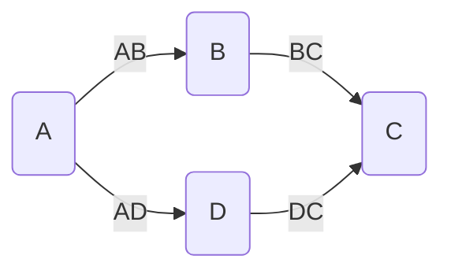
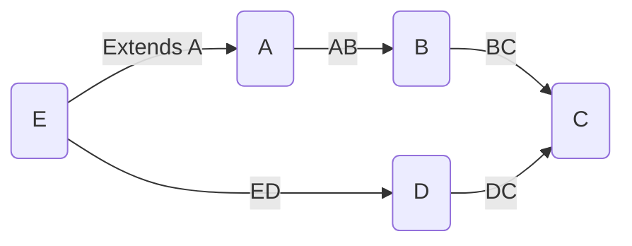
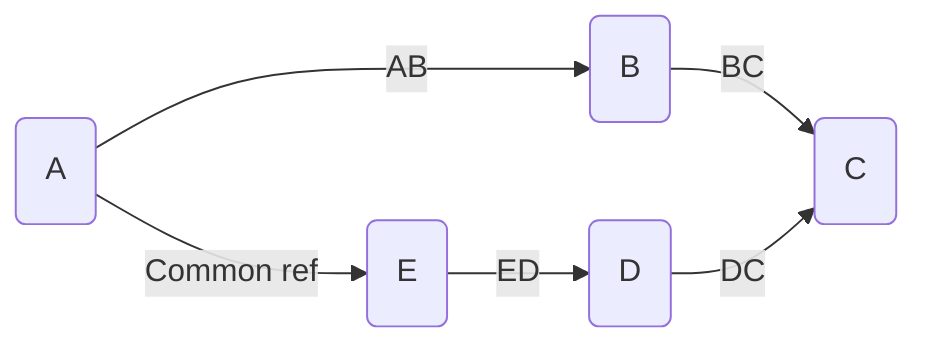

# MetaEd Merge System  

> [!INFO] General information on using merge directives, including an example of usage and impact on SQL generation, can be
> found in the MetaEd Cookbook entry [Using Merge
> Directives](https://techdocs.ed-fi.org/display/METAED20/14+-+Using+Merge+Directives).

The Ed-Fi natural key system and database patterns can cause ambiguity in what should and should not be merged.  In the early
days of MetaEd, everything was merged. This was often not what the modeler intended, as a change to one entity can cascade
merges to seemingly unrelated parts of the model.

Merging is a modeling decision. We evolved to a system where natural key collisions are detected and merges must be affirmed
by the modeler with a merge directive. If MetaEd detects a merge scenario that the modeler did not intend, the modeler is
guided to add a role name to one of the merge candidates to prevent the merge from happening.

Merging is specified in the MetaEd language by a merge directive on a property stating a merge source followed by a merge
target.   The source and target must always be the same type.  The source of a merge always begins with the parent property
and must be either a non-collection property on the current entity or a non-collection identity property on the path.   The
target must always be a non-collection identity property on the path.

While merging is a modeling decision, the rules for when merges take place are constrained by the database patterns in the
Ed-Fi ODS.  Merges are resolved in the database by eliminating one of the paths from the generation of columns and foreign
keys.  This is termed "merging away" a property in the model.  By convention, the source in a merge directive is the property
that is merged away.

Role names can be used to avoid merge issues.  Semantically, a role name annotates the meaning of the reference and allows
for multiple "kinds" of references from one entity to another.  From a database patterns perspective, role names add a prefix
to column names that cause merge collisions to be avoided.

## Merge scenarios

### General case

Consider a model where one Association/Domain Entity (A) references two other A/DEs (B, D), each of which references another
A/DE (C).

In general, all references but the initial ones must be identities for there to be a merge issue.  For this example, BC and
DC must be identity references.  The initial references (AB and AD in this example) create a merge issue if:

* AB and AD are both identities, or
* Either AB or AD is an identity, or
* AB and AD are both collections

### Extension/Subclass case

Now consider a model where we introduce an extension/subclass to an existing A/DE somewhere in the model.  For example,
remove the direct reference AD reference and instead have E extend A, and also reference D via ED.

Extensions/subclasses effectively include the properties of the base A/DE, making the merge issue rules equivalent to the
general case, only with the ED reference substituting for the AD reference.  Note that an extension/subclass can create an
issue just as well in other parts of a model, for example an extension to D that references C instead of D itself.

Note that the MetaEd language currently presents a limitation in merge directives in the extension/subclass case. Because one
of the merge paths starts on the base entity, and because the source of a merge always begins with the parent property, it is
not possible to create a merge directive with the base entity path as a merge source.  However, this is only an issue if the
modeler wants/needs the property on the base to be "merged away".

### "Common" case

Now consider a model where Common entities are in the mix, similar to the extension/subclass case.

Here, the merge issue rules require a look back to the parent entity of the Common. Because Commons can be nested, this
potentially requires multiple levels of look backs.

Note that the MetaEd language also presents a limitation in role naming that may affect this case. It is possible to get a
merge conflict situation due to a property on a Common that cannot be "role name"-ed from the A/DE level.  This is because
"role name" only applies at the level it is declared.

### Directive restrictions

If the source property path goes through a collection or common property, the target is limited to being an identity property
for the current entity.

### Multiple directives involving the same property

An issue can arise when multiple merge directives involve the same property. The problem stems from the fact that as the
result of a merge the source property is "merged away".  A property may not be merged away more than once.

## Merge System in the Codebase

There are several areas of the MetaEd codebase dealing with merges. In order of execution:

### At parse time

EntityProperty objects are created by the TopLevelEntityBuilder from .metaed files. Reference properties and shared simple
properties can have merge directives. At the textual merge directive level, these are represented by the MergeDirective
object array named "mergeDirectives", found on ReferentialProperty and the various shared simple properties (e.g.
SharedIntegerProperty). MergeDirective objects at this stage are populated with the textual merge directive information in
"sourcePropertyPathStrings" and "targetPropertyPathStrings".

### Unified plugin validation

MergeDirectiveMustStartSourcePathWithPropertyName is a validator in the unified plugin. This validator does a simple semantic
validation of merge directives without traversing the model. More advanced merge validation requires that the internal MetaEd
model be fully constructed, which happens after the unified plugin validators are run.

### Unified plugin enhancement

MergeDirectiveEnhancer is an enhancer in unified plugin that converts the textual merge directives into property reference
arrays. The "sourcePropertyPathStrings" and "targetPropertyPathStrings" are turned into arrays of EntityProperty objects
called "sourcePropertyChain" and "targetPropertyChain". Additionally, because properties can be sources or targets of merges
as a result of merge directives, EntityProperty has optional "mergeSourcedBy" and "mergeTargetedBy" arrays of EntityProperty
objects that are annotated with this information.

OutReferencePathEnhancer is an enhancer in unified plugin. While not specifically part of the merge system, it provides a
precomputation useful for advanced merge validation. The enhancer finds all possible reference paths from each entity to
other entities.

### Unified-advanced plugin validation

The MergeDirective validators in the unified-advanced plugin check for source and target property existence, as well as
correspondence to the same entity.

The OutPathsToSameEntityMustHaveMergeDirectiveOrRoleName validator in the unified-advanced plugin uses the information from
the OutReferencePathEnhancer to detect any missing merge directives. As an example, a merge directive is missing if two
identity reference paths from a parent entity both lead to a common entity, and there is no merge directive (or role name for
path differentiation) in the .metaed file for the parent entity explicitly handling this merge scenario.

### Ods-relational plugin enhancement

Column creation in the ods-relational plugin is governed by column creators (e.g. ReferencePropertyColumnCreator). In
general, scalar properties materialize as columns in the relational model. However, some properties are "merged away"
(basically skipped) by merge directives. This is handled by SkipPathBuildStrategy.

Foreign key creation in the ods-relational plugin is where merges have their most dramatic impact and is handled in
ForeignKeyCreatingTableEnhancer.

### Odsapi plugin enhancement

The EntityDefinitionLocallyDefinedPropertyEnhancer in the odsapi plugin also uses merge directive information. In the API
model, "locally defined" properties (really just certain types of db columns) can be affected by merges when a MetaEd
property that was "merged away" would have made the db column "locally defined".

## Areas for Codebase Improvement (as of early 2022)

* The object relationship information created by MergeDirectiveEnhancer is not being used to the fullest extent possible. For
  example, any code downstream of MergeDirectiveEnhancer that uses "sourcePropertyPathStrings" or "targetPropertyPathStrings"
  can be improved and simplified by switching to these richer sources of information. Foreign key generation in particular
  would benefit.
* As noted above, MetaEd originally merged like-named columns implicitly and this behavior continues today at the enhancer
  level. By MetaEd's design, it is up to the validation system to block unwanted .metaed file semantics. However, it is
  likely that validators are missing coverage such that some merges are still happening unbeknownst to the modeler, rather
  than requiring affirmative merge directives.
* On the flip side, the ods-relational plugin merge code should be revised to only merge if there is a merge directive.  Note
  this means there would be an internal error condition that crashes MetaEd if a scenario sneaks by the validators. It is the
  current potential for missing validator coverage that has made the team hesitant to implement this.
