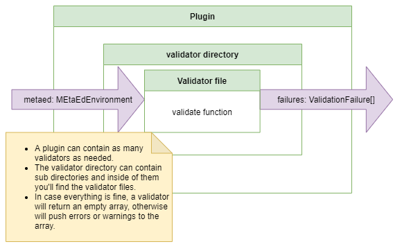

# Validators in the generation process

## Validators

A validator is basically a file named with the rule that it validates, which exports a single function named validate, that
receives an instance of MetaEdEnvironment as parameter, and returns an array of ValidationFailure objects. If the returned
array is empty, validation was successful. Validators can push both validation warnings and errors.

It is a good practice to have validators in the plugins, so that you as a developer can make sure that the plugin will run as
expected and it is supported.

Each error/warning pushed to the array will include information about the original .metaed file, and possibly the line and
character where the error was found.

## How does a validator gets integrated into the metaed-core?

Inside of metaed-core, you will find a directory named pipeline, and inside of it is a file named Pipeline.ts. In that file
is method named executePipeline which runs the full MetaEd process. Every plugin exports a function named initialize which
returns, among other things, an array of validator functions for the pipeline to execute in order.  The validator functions
for each plugin are executed one-by-one in RunValidator.ts.

After running the validators, any error/warning found, will be logged by collecting all of the resulting ValidationFailure
objects.  These include information on the error itself and the file where the error/warning is present.

